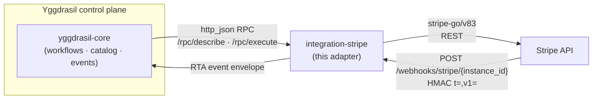
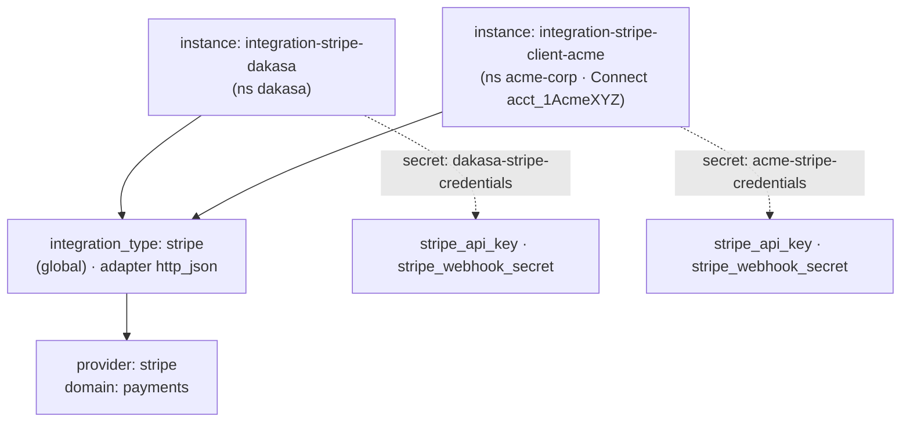
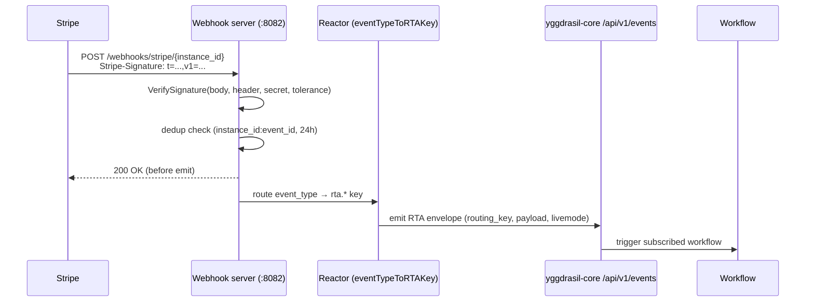

<div align="center">

# integration-stripe

**Yggdrasil integration adapter for [Stripe](https://stripe.com) — multi-tenant
payments, subscriptions, Connect, and HMAC-verified webhooks.**

[](https://github.com/dakasa-yggdrasil/integration-stripe/actions/workflows/ci.yml)
[](https://github.com/dakasa-yggdrasil/integration-stripe/actions/workflows/release.yml)


A single Go binary that turns Stripe into a declarative Yggdrasil integration:
`ensure_/observe_/destroy_` capabilities + a webhook reactor.
· [Usage](docs/USAGE.md) · [Configuration](docs/CONFIGURATION.md) · [Capabilities](docs/CAPABILITIES.md) · [Operations](docs/OPERATIONS.md) · [Development](docs/DEVELOPMENT.md)

</div>

---

## What it is

`integration-stripe` is a leaf adapter in the **Yggdrasil** ecosystem —
[Yggdrasil is a self-hosted control plane for declarative workflows +
integrations over your whole stack](https://github.com/dakasa-yggdrasil/yggdrasil-core)
(think *Backstage, but more complete and scalable*: an orchestration engine +
versioned manifest catalog + RBAC/policy + OAuth/OIDC + a pluggable integration
ecosystem). You write YAML; Yggdrasil persists, runs, and audits it.

This adapter is the Stripe plug. `yggdrasil-core` speaks to it over
`http_json` RPC (`/rpc/describe`, `/rpc/execute`); the adapter translates
Yggdrasil capabilities into Stripe API calls (via `stripe-go/v83`) and pushes
Stripe webhook deliveries back into core as workflow-triggering events. It is
**multi-tenant** by design: one Stripe account = one `integration_instance`,
each with its own API key and webhook signing secret.

## Where it fits



See [docs/OPERATIONS.md](docs/OPERATIONS.md) for the full webhook sequence.

## Family → type → instance → provider



## Capabilities

The adapter declares **19 executable capabilities + 1 webhook reactor** across
10 managed resource types. Resource operations follow the Yggdrasil universal
naming convention (`ensure_/observe_/destroy_`); money-movement and helper
actions are kept as allowlisted `create_*`/`manage_*`/`verify_*` ops.

| Capability | Resource type | Category |
|---|---|---|
| `ensure_payment_intent` | `payment_intent` | capability |
| `observe_payment_intents` | `payment_intent` | capability |
| `destroy_payment_intent` | `payment_intent` | capability |
| `ensure_customer` | `customer` | capability |
| `observe_customers` | `customer` | capability |
| `destroy_customer` | `customer` | capability |
| `ensure_subscription` | `subscription` | capability |
| `observe_subscriptions` | `subscription` | capability |
| `destroy_subscription` | `subscription` | capability |
| `observe_charges` | `charge` | capability |
| `observe_balance` | `balance` | capability |
| `ensure_webhook_endpoint` | `webhook_endpoint` | capability |
| `observe_webhook_endpoints` | `webhook_endpoint` | capability |
| `destroy_webhook_endpoint` | `webhook_endpoint` | capability |
| `create_refund` | `refund` | capability (money movement) |
| `create_setup_intent` | `setup_intent` | capability |
| `create_payout` | `payout` | capability (money movement) |
| `manage_connect_account` | `connect_account` | capability (Connect) |
| `verify_webhook_signature` | `webhook_endpoint` | capability (helper) |
| `stripe_webhook_received` | `webhook_endpoint` | **reactor** (framework-invoked) |

> Pre-v2 names (`create_payment_intent`, `confirm_payment_intent`,
> `cancel_subscription`, `list_charges`, …) still resolve through a legacy-alias
> shim that maps them to the canonical operation with a `WARN` log
> (removal target: v3.0.0). Full input/output schemas in
> [docs/CAPABILITIES.md](docs/CAPABILITIES.md).

## Quick start (local)

```bash
# Boot the adapter against stripe-mock (no real Stripe account needed):
docker compose up --build

# Adapter listens on three ports:
#   :8081  RPC      /rpc/describe  /rpc/execute
#   :8082  Webhook  /webhooks/stripe/{instance_id}
#   :8080  Health   /healthz  /readyz  /metrics

# Verify the describe handshake core uses to pin the adapter version:
curl -s localhost:8081/rpc/describe | jq '{provider, version: .adapter.version, caps: (.action_catalog | length)}'

# Run the test suite:
go test ./... -race
```

End-to-end walkthrough (install → configure an instance → run a workflow →
verify) lives in [docs/USAGE.md](docs/USAGE.md).

## Configuration

Credentials and instance settings are declared in the adapter's
`Describe()` schema and the `integration_type` manifest. Secrets are pulled from
a secret store via `credentials_ref` and never logged or round-tripped through
JSON.

| Field | Where | Type | Secret | Notes |
|---|---|---|---|---|
| `stripe_api_key` | credential | string | yes | `sk_live_*` / `rk_live_*`. Canonical. |
| `stripe_secret_key` | credential | string | yes | Alias for `stripe_api_key` (read only if the canonical is absent). |
| `stripe_webhook_secret` | credential / instance | string | yes | Webhook signing secret (`whsec_*`). |
| `stripe_account_id` | instance | string | no | Optional Connect account; sets `Stripe-Account` header. |
| `stripe_api_version` | instance | string | no | Default `2024-12-18.acacia`. |
| `webhook_tolerance_seconds` | instance | integer | no | Default `300`. HMAC timestamp window. |

Full field reference (incl. operator-metadata fields and runtime env vars) in
[docs/CONFIGURATION.md](docs/CONFIGURATION.md).

## Usage

A minimal workflow that ensures a Stripe customer exists and creates a
PaymentIntent (real capability names):

```yaml
apiVersion: yggdrasil.io/v1alpha1
kind: workflow
metadata:
  name: stripe-charge-customer
  namespace: dakasa
spec:
  steps:
    - id: customer
      capability: ensure_customer
      integration: { namespace: dakasa, name: integration-stripe-dakasa }
      input:
        email: "buyer@example.com"
        name: "Acme Buyer"
    - id: intent
      capability: ensure_payment_intent
      integration: { namespace: dakasa, name: integration-stripe-dakasa }
      input:
        amount: 4990            # cents
        currency: "brl"
        customer: "{{ steps.customer.output.customer_id }}"
        confirm: true
```

See [docs/USAGE.md](docs/USAGE.md) for the full journey.

## Webhooks & reactor

Stripe delivers events to `POST /webhooks/stripe/{instance_id}` on the webhook
port. The adapter verifies the `Stripe-Signature` header (HMAC-SHA256 over
`{t}.{body}`, comparing each `v1=` digest within the per-instance tolerance
window), deduplicates by `instance_id:event_id` (24h in-memory window), answers
`200` to Stripe **before** emitting, then maps the event type to an RTA routing
key and emits an envelope to `yggdrasil-core`.



The HMAC verification is implemented locally in
[`providers/stripe/adapter/hmac.go`](providers/stripe/adapter/hmac.go).
The event-type → routing-key map (18 known types + `rta.stripe.unhandled_event`
catch-all) is in
[`providers/stripe/adapter/event_router.go`](providers/stripe/adapter/event_router.go).
See [docs/OPERATIONS.md](docs/OPERATIONS.md) for the staging runbook.

## Operations

- `GET /healthz` — liveness (always `200`).
- `GET /readyz` — readiness (`200`).
- `GET /metrics` — 11 Prometheus series (request latency/errors, webhook
  received/dedup/signature-failures, RTA emit, execute latency, API-key-valid
  gauge, dedup-map size).

Details and troubleshooting in [docs/OPERATIONS.md](docs/OPERATIONS.md).

## Development

```bash
go test ./...          # unit + integration tests
go build ./cmd/adapter # build the binary
task up                # local stack via docker compose
```

Repo layout, the describe/execute contract, and `pkg/contractcheck` are
documented in [docs/DEVELOPMENT.md](docs/DEVELOPMENT.md).

## Compatibility

| Component | Version |
|---|---|
| `yggdrasil-sdk-go` | `v0.8.3` (`go.mod`) |
| Adapter version (`spec.go`) | `2.4.0` |
| `integration_type` manifest version | `2.2.4` |
| Stripe Go SDK | `stripe-go/v83 v83.1.0` |
| Pinned Stripe API version | `2024-12-18.acacia` |
| Go | `1.25` |

> The adapter version constant (`2.4.0`), the published-image manifest
> (`2.2.4`), and the latest released `CHANGELOG.md` entry (`2.3.1`) are not yet
> aligned — track this when registering the type into core. The describe
> handshake reports `2.4.0`.

## License

Apache-2.0 — see [LICENSE](LICENSE).

---

*Part of [Yggdrasil](https://github.com/dakasa-yggdrasil/yggdrasil-core). Last
updated 2026-06-01.*
