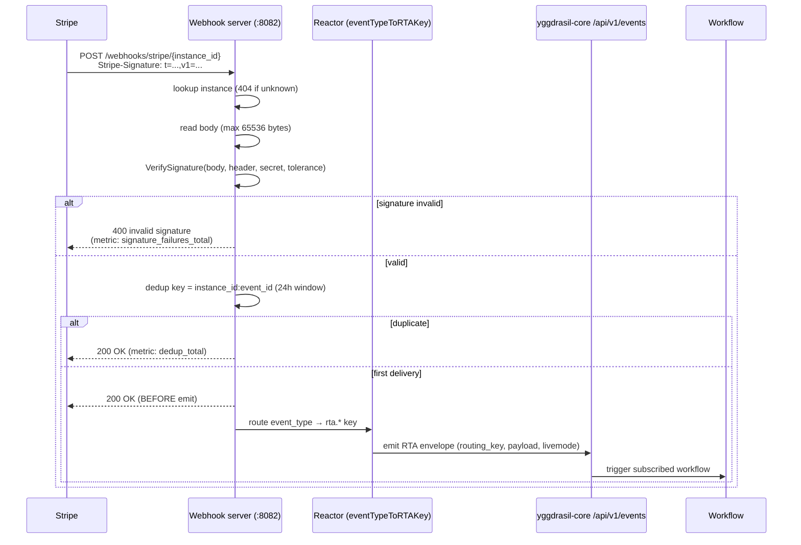

# Operations

Health, readiness, metrics, the webhook reactor flow, and common failures for
`integration-stripe`. Derived from
[`cmd/adapter/main.go`](../cmd/adapter/main.go),
[`providers/stripe/adapter/metrics.go`](../providers/stripe/adapter/metrics.go),
[`webhook_server.go`](../providers/stripe/adapter/webhook_server.go),
[`hmac.go`](../providers/stripe/adapter/hmac.go), and
[`RUNBOOK.staging.md`](../RUNBOOK.staging.md).

[back to README](../README.md) · [Usage](USAGE.md) · [Configuration](CONFIGURATION.md) · [Capabilities](CAPABILITIES.md)

---

## Listeners

The binary runs three independent HTTP servers:

| Server | Port (env / default) | Routes |
|---|---|---|
| RPC (SDK) | `ADAPTER_PORT` / `8081` | `/rpc/describe`, `/rpc/execute` |
| Webhook | `WEBHOOK_PORT` / `8082` | `/webhooks/stripe/{instance_id}` |
| Health | `HEALTHCHECK_PORT` / `8080` | `/healthz`, `/readyz`, `/metrics` |

## Health & readiness

| Endpoint | Behavior |
|---|---|
| `GET /healthz` | Liveness. Always `200 ok`. |
| `GET /readyz` | Readiness. `200 ready`. |

> The adapter has no broker connection to gate on (transport is HTTP RPC, not
> AMQP), so `/readyz` is a static `200` rather than reflecting a connection
> state. Kubelet liveness/readiness probes should target the health port.

## Metrics

`GET /metrics` (health port) exposes **11 Prometheus series** via
[`metrics.go`](../providers/stripe/adapter/metrics.go). Labels are bounded
(closed sets of capabilities, event types, routing keys, status codes; instance
count ~2–10 per deployment).

| Metric | Type | Labels | Meaning |
|---|---|---|---|
| `stripe_request_duration_seconds` | histogram | `op`, `instance` | Stripe API call latency. |
| `stripe_request_errors_total` | counter | `op`, `status_code`, `stripe_error_type`, `instance` | Stripe API call errors. |
| `stripe_webhook_received_total` | counter | `event_type`, `instance` | Webhook deliveries received (post-dedup). |
| `stripe_webhook_signature_failures_total` | counter | `instance` | HMAC verification failures. |
| `stripe_webhook_dedup_total` | counter | `instance` | Deliveries suppressed as duplicates. |
| `stripe_rta_emit_total` | counter | `routing_key`, `instance` | Successful RTA envelope emissions. |
| `stripe_rta_emit_errors_total` | counter | `routing_key`, `instance` | Failed RTA emissions. |
| `stripe_execute_requests_total` | counter | `capability`, `instance` | Execute capability invocations. |
| `stripe_execute_duration_seconds` | histogram | `capability`, `instance` | Execute capability latency. |
| `stripe_api_key_valid` | gauge | `instance` | `1` if the last background probe found the instance's API key valid, else `0`. |
| `stripe_dedup_map_size` | gauge | `instance` | Dedup entries currently held in memory. |

## Webhook reactor flow

Stripe → webhook server (HMAC verify) → reactor (event router) → core
`/api/v1/events` → workflow:



Key invariants (from [`webhook_server.go`](../providers/stripe/adapter/webhook_server.go)):

- **`200` before emit.** The HTTP `200` is written before the RTA emit so a slow
  downstream never triggers Stripe's retry storm. Emit failures log and bump
  `stripe_rta_emit_errors_total` but never affect the HTTP response.
- **Dedup is per-instance**, keyed `instance_id:event_id`, with a 24h in-memory
  TTL and lazy eviction.
- **Body cap** is 65536 bytes (`413` if exceeded).

### HMAC verification (`t=`, `v1=`)

Implemented locally in [`hmac.go`](../providers/stripe/adapter/hmac.go) (not via
an SDK helper). The `Stripe-Signature` header (`t=<unix>,v1=<hex>,...`) is
verified as:

```
signed_payload = "{t}.{raw_body}"
expected_v1    = hex( HMAC_SHA256(webhook_secret, signed_payload) )
```

Each `v1=` digest is compared in constant time; the timestamp must be within
`webhook_tolerance_seconds` (default `300`) of now. Concrete error sentinels:
`missing t=`, `missing v1=`, `timestamp beyond tolerance`, `v1 HMAC mismatch`,
`invalid t= integer`.

## Staging runbook

The full staging acceptance procedure (register type+instance, configure the
Stripe dashboard endpoint at `https://staging.dakasa.io/webhooks/stripe/dakasa`,
trigger 100 test events, verify `received = rta_emit = 100`, signature failures
`= 0`, and every DLQ stays at depth 0) lives in
[`RUNBOOK.staging.md`](../RUNBOOK.staging.md). Rollback reverts the ingress
binding to the `integration-webhooks-external` Stripe provider; Stripe retries
failed events for 72h, so short rollback windows lose no data.

## Common failures

| Symptom | Likely cause | Action |
|---|---|---|
| `404 unknown instance` on webhook | `instance_id` path segment not in the loaded instance set | Confirm the instance is registered and `STRIPE_INSTANCES_CONFIG` / env fallback hydrated it. |
| `400 invalid signature`, `signature_failures_total` climbing | wrong `stripe_webhook_secret`, clock skew, or a proxy mutating the body | Verify the secret matches the Stripe endpoint; check tolerance window and that no middleware rewrites the raw body. |
| Execute fails `stripe api key is required` | credentials not reaching `Execute()` (no `stripe_api_key`/`stripe_secret_key` in the instance's `credentials_ref`) | Ensure the secret store key is bound; see [CHANGELOG](../CHANGELOG.md) v2.2.2. |
| `unsupported capability "<x>"` | operation not in `SupportedExecuteOperations` (e.g. a typo or the reactor name) | Use a canonical capability; `stripe_webhook_received` is reactor-only. |
| `unsupported_operation` from `manage_connect_account` | `operation` not `create`/`get`/`update` | Phase 1 supports those three only. |
| RTA emit errors with `YGGDRASIL_CORE_URL` set | core unreachable / token invalid | Emission is best-effort; check `YGGDRASIL_CORE_URL` + `YGGDRASIL_RUN_TOKEN` and core's `/api/v1/events`. |
